# Minibot middle

知能ロボコンロボットプロトタイプの説明。

## インストール

```shell
$ cd ~/catkin_ws/src
$ git clone https://github.com/KMiyawaki/oit_navigation_minibot_middle_01.git
$ cd ~/catkin_ws/src/oit_navigation_minibot_middle_01
$ ./install.sh
# 自動的に再起動される。
```

- テレオペや地図作成にはジョイスティックがあった方が便利。

## ロボットの起動

### バッテリーの電源を入れる

二つの`OmniCharge`の電源ボタンを長押しする。

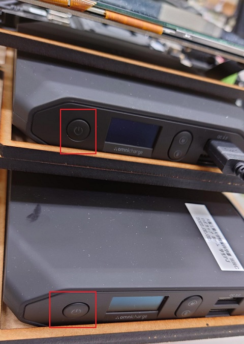

下段（モータ用電源）の`OmniCharge`の電源ボタンを2回素早くクリックし、メニューを表示する。

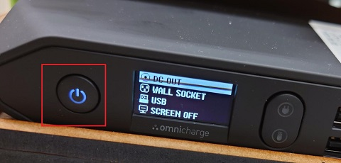

`DC OUT`を選択して電源ボタンを1回クリックする。

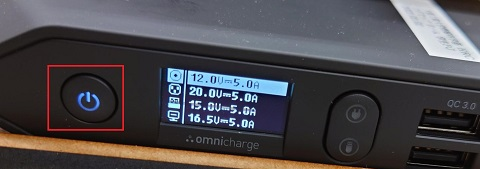

`12.0V-5A`を選択して電源ボタンを1回クリックする。

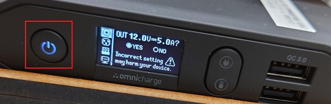

`Yes`を選択して電源ボタンを1回クリックする。


`DC`の表示があれば`RoboClaw`に電源が供給されている。

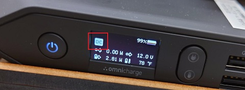

### LattePanda の電源を ON にする

前項に沿って上段`OmniCharge`の電源が入っていることを確認する。

しばらくしてから（モータ電源を入れる作業をする程度の時間）`LattePanda`の電源ボタンを長押しする。

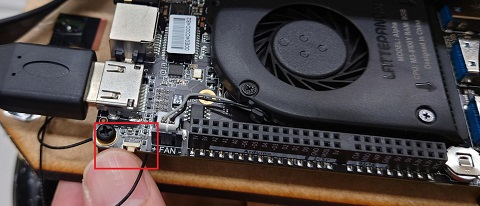

青のLEDが点灯し電源がONになる。  
しばらくするとディスプレイに画面が表示される。なお、液晶ディスプレイのタッチパネルは無効である。

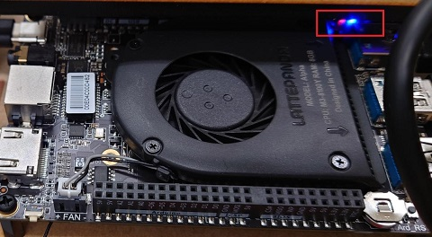

### Bluetooth キーボードを接続する

キーボードの電源を入れ、何等かのキーを押したりタッチパッドで指をスライドさせたりしていると、`Ubuntu`のデスクトップのマウスカーソルが動く。

もし表示がされないようならデプスカメラの USB ケーブルを抜いて有線キーボードを接続し、 BlueTooth 接続を再度実施すること。

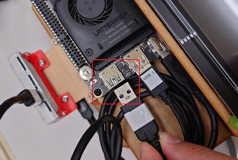

Bluetooth キーボードはタッチパッド上で一本指でタッチするとクリック、２本指でタッチすると右クリックになっている。

## テレオペの起動

ジョイスティックでロボットを操作する。LRF（Laser Range Finder）も起動する。ロボットの動作テストに用いる。

デプスカメラの USB ケーブルを抜いてジョイスティックを接続し、任意のディレクトリで下記のコマンドを起動する。

```shell
$ roslaunch oit_navigation_minibot_middle_01 teleop.launch
# teleop:=key をつけるとキーボードによるテレオペが起動する。
```

## テレオペの起動（デプスカメラあり）

キーボードでロボットを操作する。USB ポートにデプスカメラを接続しておけば起動する。LRF（Laser Range Finder）も起動する。ロボットの動作テストに用いる。

任意のディレクトリで下記のコマンドを起動する。

```shell
$ roslaunch oit_navigation_minibot_middle_01 teleop.launch teleop:=key
```

キーボードテレオペのソフト（図中赤枠）のウィンドウをクリックしてから矢印キーで操作すること。

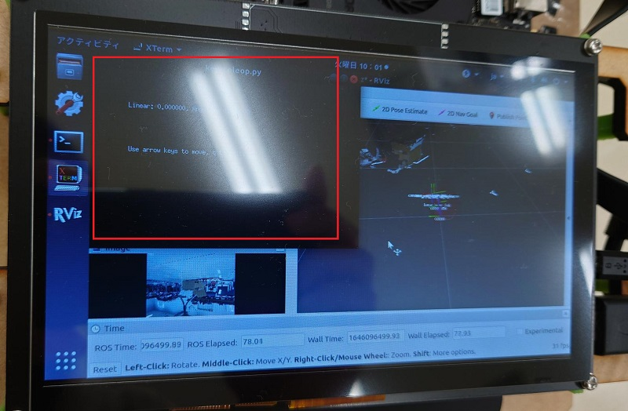

## SLAMによる地図作成

ジョイスティックでロボットを操作しながらロボット周囲の環境の地図を作成する。

```shell
$ roslaunch oit_navigation_minibot_middle_01 mapping.launch
# teleop:=key をつけるとキーボードによるテレオペが起動する。
```

地図作成が終わったら、上記で起動したソフトを**絶対に終了させずに**別ターミナルで以下のコマンドを実行して地図を保存する。

```shell
$ roscd oit_navigation_minibot_middle_01/maps
$ rosrun map_server map_saver -f test # test の部分は任意の地図名をつける。
[ INFO] [1615598383.151895509]: Waiting for the map
[ INFO] [1615598383.434767477]: Received a 480 X 736 map @ 0.050 m/pix
[ INFO] [1615598383.434929931]: Writing map occupancy data to sample_01.pgm
[ INFO] [1615598383.449962167]: Writing map occupancy data to sample_01.yaml
[ INFO] [1615598383.450234503]: Done
```

保存ができたら、ソフトを終了させてよい。  
その後地図ファイルの有無を確認する。

```shell
$ roscd oit_navigation_minibot_middle_01/maps
$ ls test* # test は保存時につけた地図名
test.pgm
test.yaml
```

## ナビゲーション

前項で保存した地図を使いナビゲーション（自律移動）をする。デプスカメラは USB ポートに接続しておくこと。
ここで、地図の名前とは前項で保存した地図ファイル名から拡張子を取り除いたものである。

- 例：`test.pgm  test.yaml`の場合、地図名は`test`。

```shell
$ roslaunch oit_navigation_minibot_middle_01 navigation.launch map_name:=test # map_name:=以降の文字をナビゲーション時に利用する地図名に変更する。
```

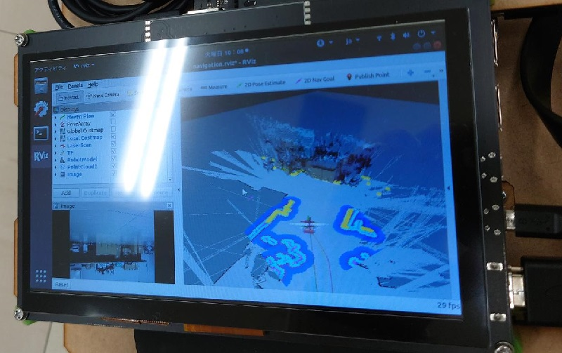

自己位置推定、ゴール指定方法はこれまで通り。

## ロボットの電源を OFF にする

- ロボット側端末で`LattePanda`をシャットダウンする。

```shell
$ sudo shutdown -h now
```

２台の`OmniCharge`の電源ボタンを長押ししてオフにする。充電用ACアダプタを接続して充電する。

このとき、下段の`OmniCharge`は`RoboClaw`用のDCプラグを外して良い。充電完了してロボットを利用する際に再接続する。

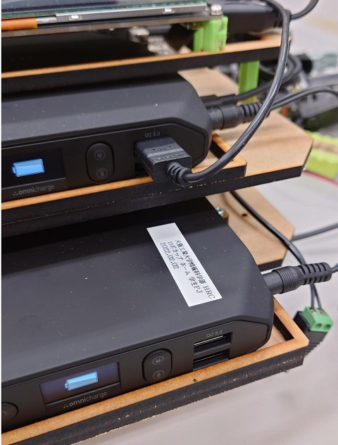

## 作成した地図をシミュレータで使う

```shell
$ roscd oit_navigation_minibot_middle_01/maps
$ ls test* # 地図のファイルを確認
test.pgm  test.yaml
$ ./make_stage_world.sh test.yaml
Add black border into test.pgm... 
Generated test_border.png
$ ls test* # 地図とシミュレータのファイルを確認
test.pgm  test.world  test.yaml  test_border.png
$ roslaunch oit_navigation_minibot_middle_01 stage_navigation.launch map_name:=test
```

### Stage によるナビゲーション

```shell
$ roslaunch oit_navigation_minibot_middle_01 stage_navigation.launch map_name:=test # map_name:=以降の文字をナビゲーション時に利用する地図名に変更する。
```
