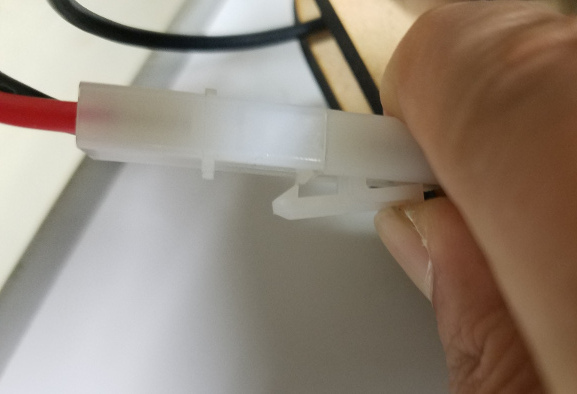

# Minibot middle

演習用小型ロボットの説明。

## インストール

```shell
$ cd ~/catkin_ws/src
$ git clone https://github.com/KMiyawaki/oit_navigation_minibot_middle_01.git
$ cd ~/catkin_ws/src/oit_navigation_minibot_middle_01
$ ./install.sh
# 自動的に再起動される。
```

- テレオペや地図作成にはジョイスティックがあった方が便利。

## ロボットの起動

### 電池を接続する

コネクタの向き（リード線の色）に注意して電池を接続する。


### Jetson NANO 用の電源を ON にする

DC-DC コンバータの LED（図中指差ししている箇所）が赤くなっていなければ電源ボタンを押す。


ディスプレイに Ubuntu の画面が表示されると、Jetson NANO の起動は完了している。液晶ディスプレイはタッチパネルである。


### Bluetooth キーボードを接続する

キーボードの電源を入れ、何等かのキーを押したりタッチパッドで指をスライドさせたりしていると、Ubuntu のデスクトップ画面右上の Bluetooth アイコンにカギのマークが表示され、マウスカーソルがディスプレイに表示される。


もし表示がされないようなら Ubuntu のデスクトップ画面右上の Bluetooth マークから接続してみる。


Bluetooth キーボードはタッチパッド上で一本指でタッチするとクリック、２本指でタッチすると右クリックになっている。

### テレオペの起動

ジョイスティックでロボットを操作する。LRF（Laser Range Finder）も起動する。ロボットの動作テストに用いる。  
ジョイスティックを液晶ディスプレイ横の USB ポートに接続する。


任意のディレクトリで下記のコマンドを起動する。

```shell
$ roslaunch oit_navigation_minibot_middle_01 teleop.launch
# teleop:=joy をつけるとジョイスティックによるテレオペが起動する。
```

### SLAMによる地図作成

ジョイスティックでロボットを操作しながらロボット周囲の環境の地図を作成する。

```shell
$ roslaunch oit_navigation_minibot_middle_01 mapping.launch
# teleop:=joy をつけるとジョイスティックによるテレオペが起動する。
```

地図作成が終わったら、上記で起動したソフトを**絶対に終了させずに**別ターミナルで以下のコマンドを実行して地図を保存する。

```shell
$ roscd oit_navigation_minibot_middle_01/maps
$ rosrun map_server map_saver -f test # test の部分は任意の地図名をつける。
[ INFO] [1615598383.151895509]: Waiting for the map
[ INFO] [1615598383.434767477]: Received a 480 X 736 map @ 0.050 m/pix
[ INFO] [1615598383.434929931]: Writing map occupancy data to sample_01.pgm
[ INFO] [1615598383.449962167]: Writing map occupancy data to sample_01.yaml
[ INFO] [1615598383.450234503]: Done
```

保存ができたら、ソフトを終了させてよい。  
その後地図ファイルの有無を確認する。

```shell
$ roscd oit_navigation_minibot_middle_01/maps
$ ls test* # test は保存時につけた地図名
test.pgm
test.yaml
```

### ナビゲーション

前項で保存した地図を使いナビゲーション（自律移動）をする。  
まず、起動用スクリプトを編集し、ナビゲーションに使いたい地図の名前を入力しておく。  
ここで、地図の名前とは前項で保存した地図ファイル名から拡張子を取り除いたものである。

- 例：`test.pgm  test.yaml`の場合、地図名は`test`。

```shell
$ roslaunch oit_navigation_minibot_middle_01 navigation.launch map_name:=test # map_name:=以降の文字をナビゲーション時に利用する地図名に変更する。
```

自己位置推定、ゴール指定方法はこれまで通り。

## ロボットの電源を OFF にする

- ロボット側端末で Jetson NANO をシャットダウンする。

```shell
$ sudo shutdown -h now
```

- 起動時に押下した、Jetson NANO 用の電源スイッチを OFF にする。
  - DC-DC コンバータの LED が消灯する。

## 作成した地図をシミュレータで使う

```shell
$ roscd oit_navigation_minibot_middle_01/maps
$ ls test* # 地図のファイルを確認
test.pgm  test.yaml
$ ./make_stage_world.sh test.yaml
Add black border into test.pgm... 
Generated test_border.png
$ ls test* # 地図とシミュレータのファイルを確認
test.pgm  test.world  test.yaml  test_border.png
$ roslaunch oit_navigation_minibot_middle_01 stage_navigation.launch map_name:=test
```

### Stage によるナビゲーション

```shell
$ roslaunch oit_navigation_minibot_middle_01 stage_navigation.launch map_name:=test # map_name:=以降の文字をナビゲーション時に利用する地図名に変更する。
```

## ロボットから電池を外して充電する

- コネクタのロックを十分に押して完全に外す。
- リード線ではなく、コネクタをしっかりと掴んで引き抜く。
  - リード線を強引に引っ張ると、DC-DC コンバータからリード線が抜けてしまう。注意して引き抜くこと。



- 充電器に電池を接続し、 NiMH のLEDが点灯していることを良く確認して BATTERY ボタンを長押しする。
  - NiMH の LED が点灯していない場合は BATTERY ボタンを複数回押して NiMH に合わせる。
- NiMH の LED が赤く点灯し充電が始まる。
  - 充電中は点滅する。詳細は[充電器のマニュアル](https://hitecrcd.co.jp/download/x1nano-jpn/)を参照。


- NiMH の LED が緑色に点灯すると充電は完了している。


